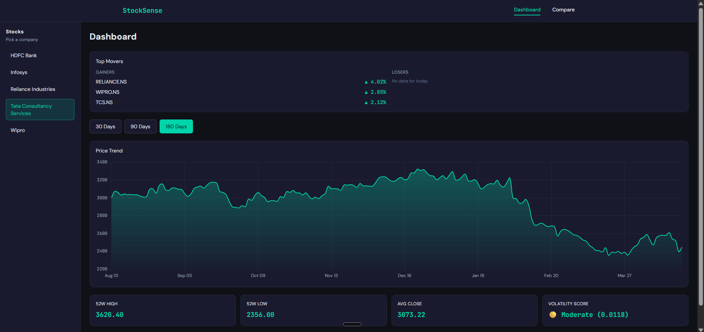
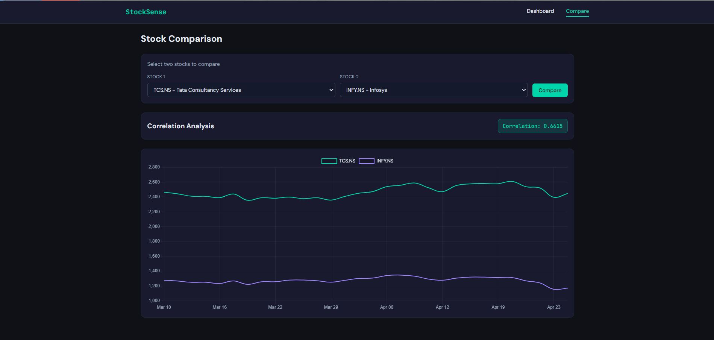

# StockSense

StockSense is a full-stack stock intelligence dashboard built with Node.js, Express, React, Redux Toolkit, MySQL, and Chart.js. It tracks Indian equities, visualizes price history, highlights top movers, and compares two stocks side by side with correlation analysis.

## What It Does

- Shows a dashboard with top gainers and losers for the latest trading day.
- Lets users pick a stock and inspect 30, 90, or 180 days of price history.
- Displays 52-week high, 52-week low, average close, and volatility score.
- Compares two stocks with a dual-line chart and Pearson correlation.
- Uses a clean dark terminal-style UI with accent colors for gains and losses.

## Screenshots





## Tech Stack

### Backend

- Node.js
- Express.js
- MySQL 2 (`mysql2/promise`)
- Axios
- dotenv

### Frontend

- React 19
- Vite
- Redux Toolkit
- React Router DOM
- Tailwind CSS
- Chart.js
- react-chartjs-2

## Project Structure

```text
Stocksense/
├── backend/
│   ├── app.js
│   ├── server.js
│   ├── config/
│   ├── controllers/
│   ├── middleware/
│   ├── postman/
│   ├── routes/
│   ├── scripts/
│   └── utils/
├── frontend/
│   ├── src/
│   │   ├── components/
│   │   ├── pages/
│   │   ├── services/
│   │   └── store/
│   └── index.html
└── README.md
```

## Setup

### 1. Install dependencies

```bash
cd backend
npm install

cd ../frontend
npm install
```

### 2. Configure environment variables

Create a `.env` file in `backend/`:

```env
DB_HOST=localhost
DB_USER=root
DB_PASSWORD=your_password
DB_NAME=stocksense
PORT=5000
FRONTEND_URL=http://localhost:5173
```

### 3. Create the database and seed data

Run the SQL schema first, then seed the database:

```bash
cd backend
npm run seed
```

If you prefer to load the schema manually, use the SQL file that defines the `companies`, `stock_prices`, and `yearly_summary` tables.

### 4. Start the apps

Backend:

```bash
cd backend
npm run dev
```

Frontend:

```bash
cd frontend
npm run dev
```

## Backend Scripts

From `backend/package.json`:

- `npm run dev` starts the API with nodemon.
- `npm start` runs the API with node.
- `npm run seed` fetches market data and seeds MySQL.

## Frontend Scripts

From `frontend/package.json`:

- `npm run dev` starts Vite.
- `npm run build` builds the production bundle.
- `npm run lint` runs ESLint.
- `npm run preview` previews the production build.

## API Endpoints

Base URL: `http://localhost:5000/api`

| Method | Endpoint           | Description                                           | Parameters                                         | Example                                       |
| ------ | ------------------ | ----------------------------------------------------- | -------------------------------------------------- | --------------------------------------------- |
| GET    | `/health`          | Health check for the backend service                  | None                                               | `/health`                                     |
| GET    | `/companies`       | Returns the list of tracked companies                 | None                                               | `/companies`                                  |
| GET    | `/data/:symbol`    | Returns historical stock price data for one symbol    | Path: `symbol`, Query: `range` (`30`, `90`, `180`) | `/data/RELIANCE.NS?range=30`                  |
| GET    | `/summary/:symbol` | Returns 52-week summary metrics for one symbol        | Path: `symbol`                                     | `/summary/TCS.NS`                             |
| GET    | `/compare`         | Returns aligned series and correlation for two stocks | Query: `symbol1`, `symbol2`                        | `/compare?symbol1=RELIANCE.NS&symbol2=TCS.NS` |
| GET    | `/top-movers`      | Returns the latest gainers and losers                 | None                                               | `/top-movers`                                 |

## Response Shape Notes

- `/companies` returns an array of `{ symbol, name, sector }` objects.
- `/data/:symbol` returns `{ symbol, data: [...] }` with OHLCV, daily return, and 7-day moving average.
- `/summary/:symbol` returns `{ symbol, week52_high, week52_low, avg_close, volatility_score }`.
- `/compare` returns `{ symbol1, symbol2, correlation, data: { [symbol1]: [...], [symbol2]: [...] } }`.
- `/top-movers` returns `{ gainers: [...], losers: [...] }`.

## Why Node.js Instead of Python

StockSense uses Node.js because the application is already built around JavaScript end to end. That keeps the backend, frontend, and shared data shapes in the same language, which makes debugging, validation, and handoff simpler.

Node.js also fits the app’s workload well. The backend mostly coordinates I/O-heavy work like fetching Yahoo Finance data, reading from MySQL, and serving JSON APIs. Express handles that pattern cleanly without introducing an additional runtime or a second ecosystem just for the API layer.

For this project, staying in JavaScript also made it easier to keep the Redux state, API service layer, and backend response shapes aligned without translation overhead between Python and JavaScript objects.

## Postman Collection

A ready-to-import Postman collection is available at:

`backend/postman/StockSense.postman_collection.json`

It contains the five core API requests used by the dashboard and compare flows.

## Notes

- The backend seeds data for the tracked Indian stocks using Yahoo Finance.
- The frontend uses a dark theme with teal for gains and red for losses.
- Chart labels are formatted as `DD MMM` for readability.
